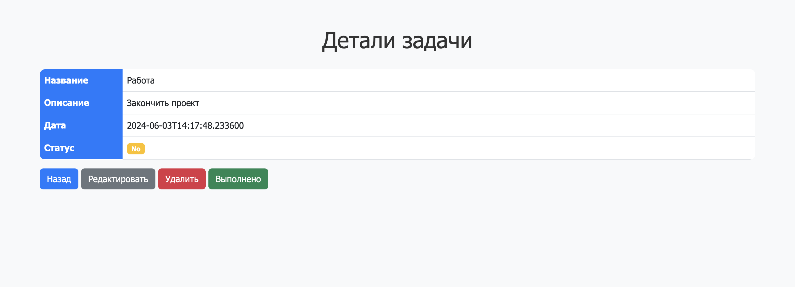
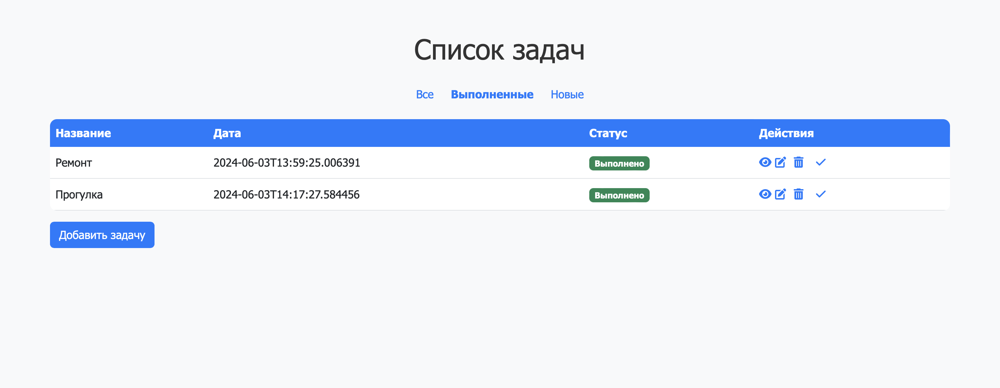

# Job4j TODO Application

## Описание

Job4j TODO - это простое веб-приложение для управления списком задач. Приложение позволяет создавать, редактировать, удалять задачи и отмечать их как выполненные. Также имеется возможность фильтрации задач по их статусу: все, выполненные и новые.

## Установка

1. Склонируйте репозиторий:
    ```bash
    git clone https://github.com/Blagov13/job4j_todo.git
    ```
2. Перейдите в директорию проекта:
    ```bash
    cd job4j_todo
    ```
3. Запустите приложение (например, с использованием Maven):
    ```bash
    mvn spring-boot:run
    ```
### Доступ к приложению

После успешного запуска приложение будет доступно по адресу: [http://localhost:8080](http://localhost:8080)

## Использование

### Главная страница - Список задач

На главной странице отображается список всех задач. Можно переключаться между отображением всех задач, выполненных задач и новых задач.


### Страница создания задачи

На этой странице можно создать новую задачу, указав ее описание и статус.


### Страница редактирования задачи

На этой странице можно изменить описание задачи и ее статус.


### Страница деталей задачи

На этой странице отображаются подробности выбранной задачи.



## Фильтрация задач

На главной странице можно фильтровать задачи по статусу:
- Все задачи
- Выполненные задачи
- Новые задачи



## Архитектура

Проект использует следующие технологии и фреймворки:
- Spring Boot
- Thymeleaf
- Hibernate
- Bootstrap
- PostgreSql

### Структура проекта

- `src/main/java` - исходный код приложения
- `src/main/resources` - ресурсы приложения

## Контакты

Если у вас есть вопросы или предложения, пожалуйста, свяжитесь с нами:

- Автор проекта: [Blagov13](https://github.com/Blagov13)
- Электронная почта: blagov13rus@gmail.com